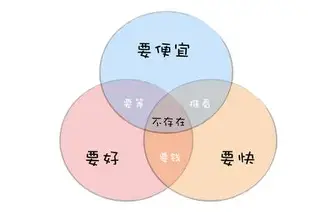

新年快乐 everyone~🎉🎉🎉

很高兴在2026的第一天遇见大家！

# 回顾2025

作为学生党，成绩或许是首先要说的。还可以，在前20徘徊，算上体育。体育给我拖后腿啦

当然，因为编程控，以及各种捣鼓，尤其是为了免费而大大花去的时间成本，让“摸鱼”的我浪费了许多时间

甚至熬夜到很晚

提醒自己，放个三色图

希望2026年，可以平衡好时间和需求

# 看跨晚的感想

本着资源多会更好的心，去看了央视的跨晚。今年基本全是歌舞，都是正能量的，因为形式相似才不够吸引人

从作者栏上，可以看出这次有很多AIGC歌曲。很高兴可以看到AIGC创作产业化的形势。

学人跳舞动作的机器人，让我想到之前宇树科技工程师被踹的那个视频

https://www.sohu.com/a/970264252_121654491

有个小细节，在几个节目中，都出现了同样的音乐机器人，同款机器人被复用了。

今天去看了一部分B站跨晚的回放，针对年轻人的舞台设计和游戏元素的融入，被吸引到了！

最后，依旧祝大家新年快乐~

