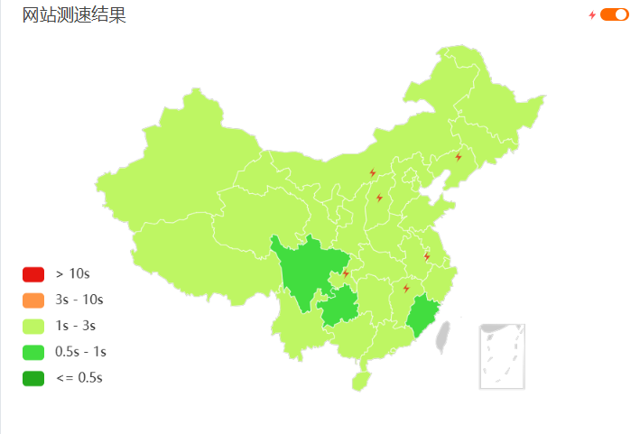
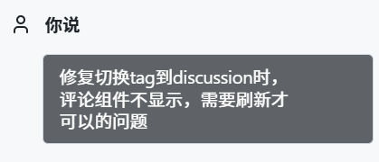
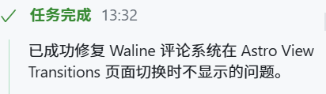
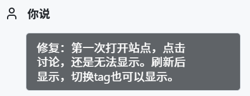

## 关于技术

这个博客，是我首次接触到 **Astro**
之前在B站上看到过程序员鱼皮的视频，是Astro的模板库，可以快速构建官网
当时试着用过，但是都只是改前端，所以不算接触

然后是统计栏，**Umami**这个访问量统计工具我也是第一次碰到，方法来自 [一个同为Fuwari主题的博客](https://tianhw.top/posts/fuwari-umami-stats/)。此处有坑，下文细讲。

那个评论系统 [**Walinejs**](https://github.com/walinejs/waline)，之所以不选择基于Github的，是因为我希望可以在大陆有良好的访问，也不希望Github账号成为分享的必需品。这个评论系统功能挺丰富，力荐。

以及，颜色随着时间变化的功能。HUE 范围为0~360，简单计算可得4分钟加一最佳。于是将这个思路给到了**KiloCode**，开始Vibe。我使用的是Claude Sonnet 4.5，整体逻辑能力可以，但还是错误一堆，也不看全局。当然肯定不会为此付出高额的费用，我使用的是一个公益站，由衷感谢公益佬。

这个博客部署在 **Netlify**上。vercel 和 cf 的速度一向慢（cf 由于没绑付款方式没法优选），edgeone不备案的话，尽管会分到新加坡节点，但是体验上与cf相差不大。之前对比测速过，以及根据某站中的讨论，**Netlify**会更快些。

## 踩雷

部署过程中踩了很多雷，这里一一讲述。

#### 开发与生产不一致

在本地，我用`pnpm dev`，所有卡片都是不透明的。而上netlify之后就变成半透明，可读性很差。用claude修了半天弄不好，于是我手动定位到相关样式，把带透明度的样式改成了white和black，解决。

####  AI 啥也不是

说实话，颜色随着时间变化 这个功能，我是打着Vibe的旗号，实际上还得是自己肝

Claude 只会添加逻辑，却不把逻辑应用到实际上——准确的说，是只应用了一个地方，其余引用硬编码配置的地方都没有修改。

不过可以理解，AI不会读完整个代码库，只会推测这些引用会在哪里出现，有遗漏很正常。

#### 局部更新导致的错误

对于评论页面，会有这样一个经典的bug：

当切换tag（局部更新），组件不加载出来，需要刷新才有。

本来这是一个很简单的bug，多绑定一个事件侦听器即可，于是我交给了AI。

Claude 也没辜负我的期望

切换tag的问题修完，我兴奋地提交了commit。

可到生产域名测试，却偶然又发现问题。

兴许是我表达的问题，AI始终修不好，于是我命令claude将评论的加载挪到全局样式里去试试。

尽管这是一个暴力的办法，并非最佳实践，但也是解决bug的最快方法。

Done.

#### 广告屏蔽器的锅

制作统计栏时，发现一直无法从Umami获取数据，Umami也无法获取我的访问数据

打开网络控制台才发现，一个明晃晃的“已屏蔽”

第一时间想到广告管理器Adgruard，将页面加入白名单，解决。

于是我在统计栏加了一个Tip。

#### 友链卡片

一开始，鉴于单独写页面过于麻烦，直接使用文章+note突出显示的方式放友链

后来奈何实在不美观，上网搜索，发现这么一篇文章：https://aulypc1.github.io/posts/website/add_friendspage_in_fuwari/

不错，挺美观的。
